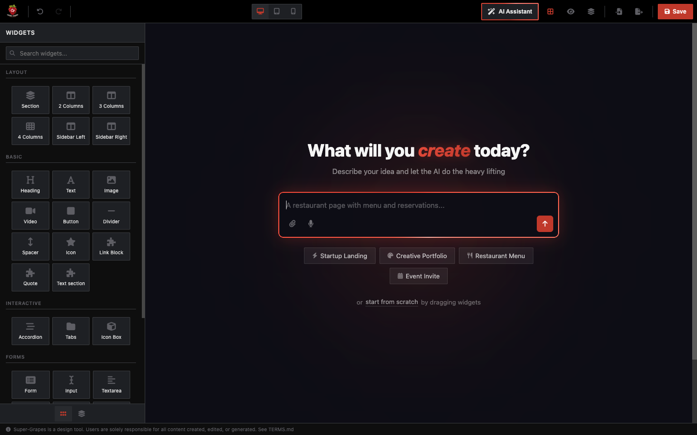
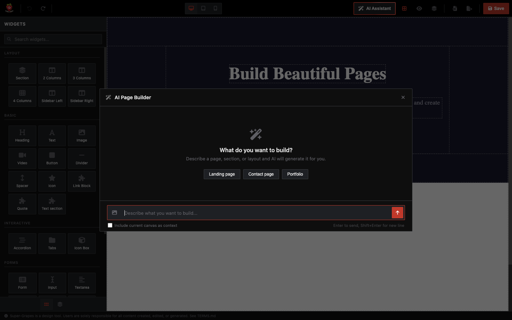
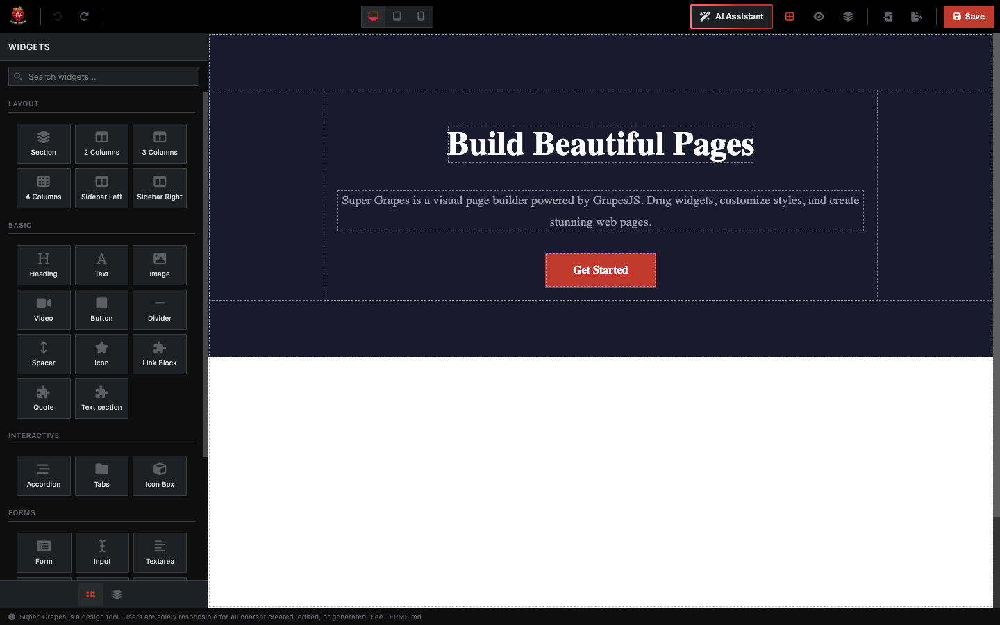
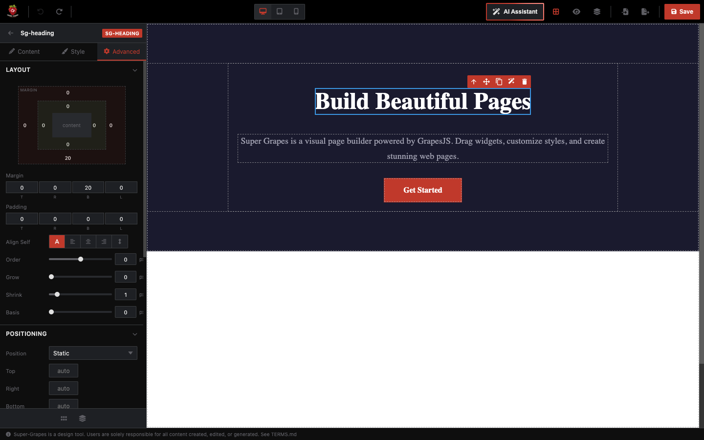
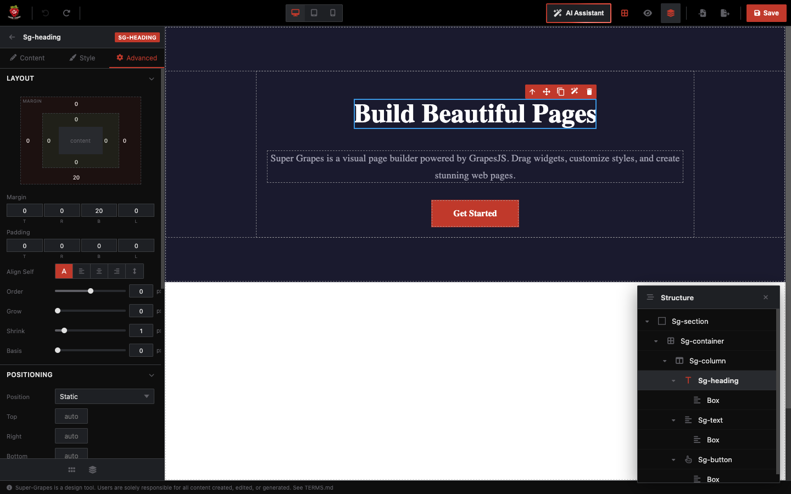

# Super Grapes

A modern visual page builder powered by [GrapesJS](https://grapesjs.com). Dark-themed, AI-assisted, fully customizable.

## AI-Powered Page Generation

When the canvas is empty, Super Grapes presents an AI prompt with animated borders, suggestion chips, and voice input. Describe what you want and get a full page generated instantly.



Three AI modes:
- **Replace** (topbar) — Generate a full page from scratch
- **Append** (canvas bar) — Add new sections below existing content
- **Edit** (toolbar/context menu) — Modify a selected component with AI

Supports any OpenAI-compatible API, brand color injection, image attachments, voice-to-text, and custom design skills.



---

## Drag & Drop Editor

24 pre-built widgets in 5 categories. Drag from the sidebar, drop onto the canvas.



---

## Visual Style Editing

Select any component and fine-tune through three sidebar tabs:

**Style** — Display, dimensions, typography, decorations, margins/padding with Normal/Hover toggle:


**Advanced** — Layout box model, positioning, flex properties, responsive visibility:



---

## Component Navigator

Hierarchical tree view with expand/collapse, click-to-select, rename, and visibility toggle.



---

## Responsive Design

Built-in device switcher for Desktop (100%), Tablet (768px), and Mobile (375px).


---

## More Features

- **Undo/Redo** with keyboard shortcuts (Cmd+Z / Cmd+Shift+Z)
- **Copy/Paste** components (Cmd+C / Cmd+V)
- **Import/Export** HTML with copy-to-clipboard and file download
- **Context menu** with right-click actions
- **Preview mode** — full-screen, no editor chrome
- **Template system** for reusable page sections
- **Local storage** with autosave
- **Dark theme** with `--sg-*` CSS custom properties

---

## Installation

Super Grapes is distributed via [GitHub Packages](https://github.com/features/packages).

### 1. Authenticate

Create a [Personal Access Token](https://github.com/settings/tokens) with `read:packages` scope:

```bash
# ~/.npmrc
//npm.pkg.github.com/:_authToken=YOUR_GITHUB_PAT
@paulpwo:registry=https://npm.pkg.github.com
```

### 2. Install

```bash
npm install @paulpwo/super-grapes grapesjs
```

### 3. Use

```typescript
import { createEditor, UIManager } from '@paulpwo/super-grapes';
import '@paulpwo/super-grapes/style.css';

const app = document.getElementById('app')!;

// 1. Create the UI shell
const ui = new UIManager(app);

// 2. Create the editor
const editor = createEditor({
  container: '#sg-canvas',
  ai: {
    apiKey: 'your-api-key',
    model: 'gpt-4o',
  },
  onReady: (ed) => console.log('Ready!', ed),
});

// 3. Connect
ui.connect(editor);
```

---

## Configuration

### `SuperGrapesConfig`

| Option | Type | Description |
|--------|------|-------------|
| `container` | `string` | CSS selector for canvas (default: `#sg-canvas`) |
| `ai` | `AiConfig` | AI assistant configuration |
| `storage` | `StorageConfig` | `local`, `remote`, or `none` |
| `plugins` | `SuperGrapesPlugin[]` | Additional GrapesJS plugins |
| `onReady` | `(editor) => void` | Callback when ready |

### `AiConfig`

| Option | Type | Description |
|--------|------|-------------|
| `apiKey` | `string` | API key (required) |
| `model` | `string` | Model name (e.g., `gpt-4o`, `gemini-2.5-flash`) |
| `baseURL` | `string` | Custom endpoint for OpenAI-compatible APIs |
| `brandColors` | `BrandColors` | Colors injected into AI prompt for consistent output |
| `skills` | `string[]` | Custom design skill prompts (markdown) |
| `builtinSkills` | `boolean` | Built-in frontend design skill (default: `true`) |

---

## Development

```bash
git clone https://github.com/paulpwo/super-grapes.git
cd super-grapes
pnpm install
pnpm dev        # http://localhost:5173
pnpm build      # Build to dist/
```

---

## Tech Stack

[GrapesJS](https://grapesjs.com) v0.21 | [Vite](https://vitejs.dev) | [TypeScript](https://www.typescriptlang.org) | [OpenAI SDK](https://github.com/openai/openai-node) | [Font Awesome 6](https://fontawesome.com)

---

## License

Proprietary. See [LICENSE](LICENSE) for details.
