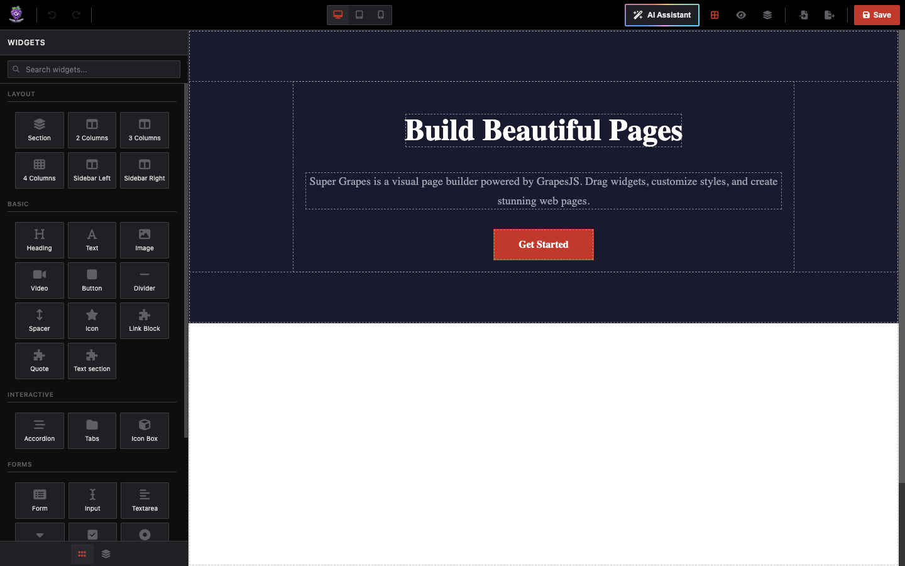
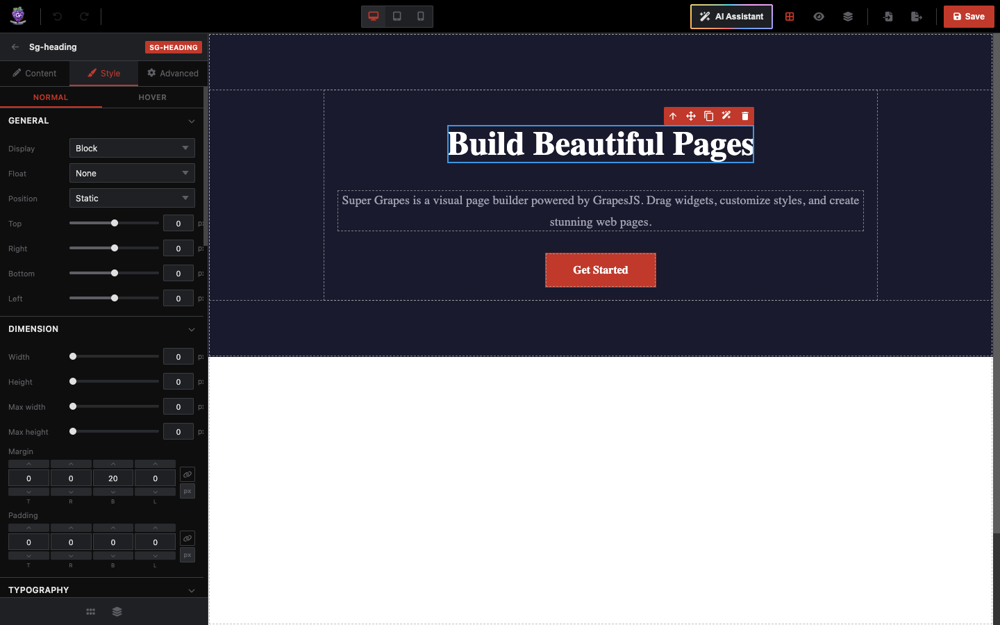
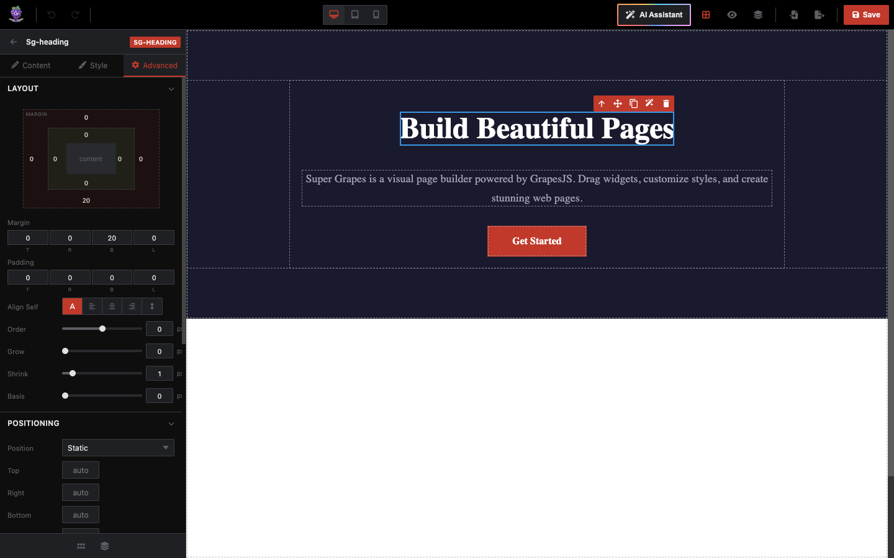
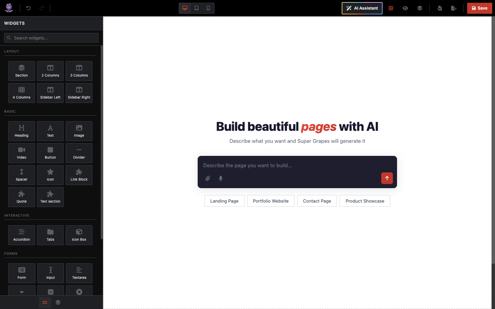
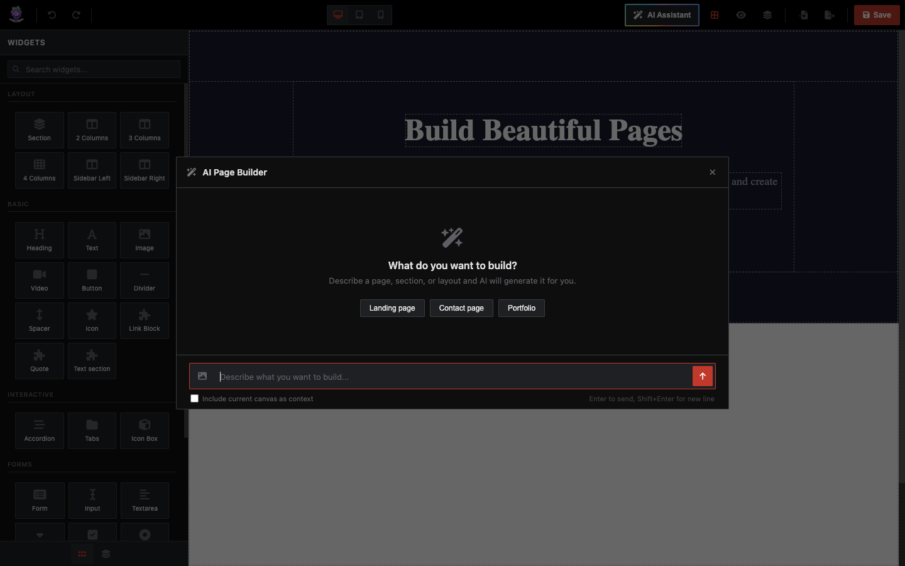
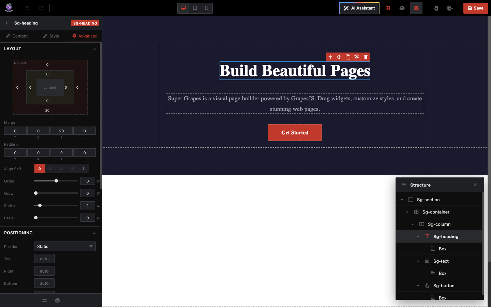
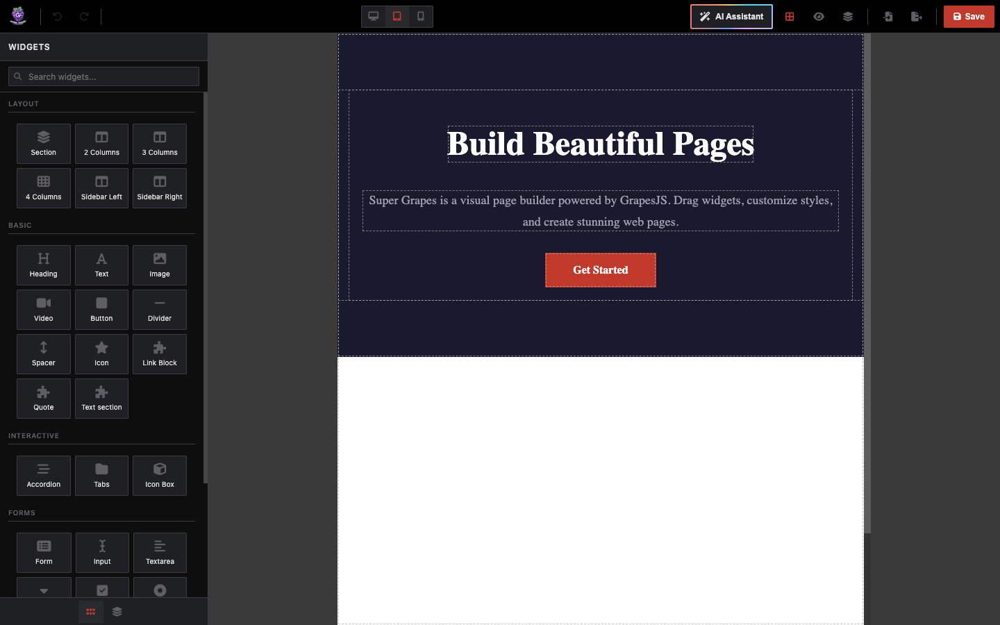
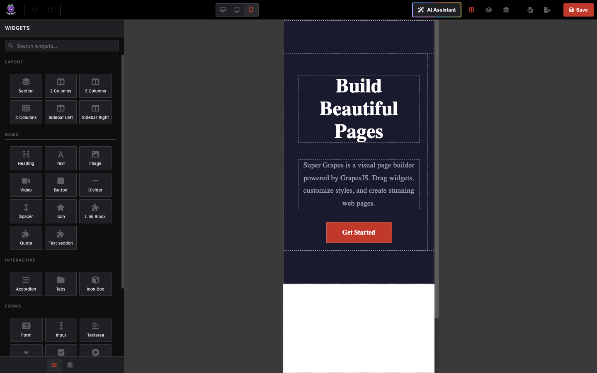
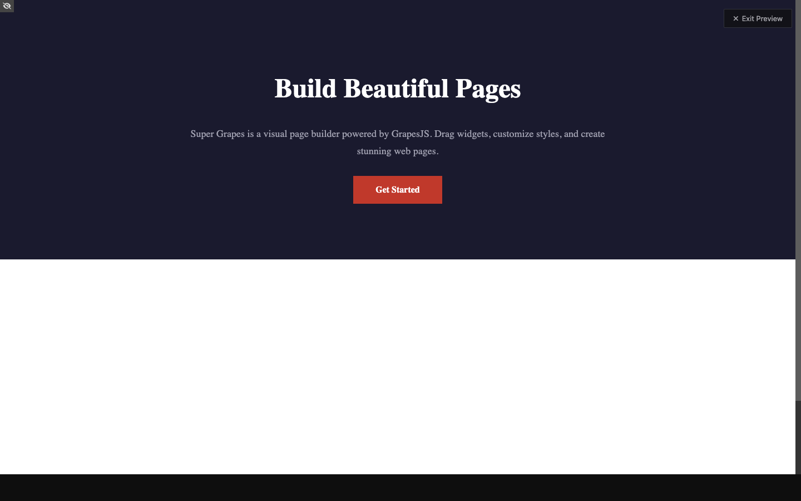

# Super Grapes

A modern visual page builder powered by [GrapesJS](https://grapesjs.com). Dark-themed, AI-assisted, fully customizable.



## Features

### Drag & Drop Widgets

24 pre-built blocks organized in 5 categories: **Layout**, **Basic**, **Interactive**, **Forms**, and **Extra**. Search, drag, and drop directly onto the canvas.

### Visual Style Editing

Select any component and edit its styles through an intuitive sidebar with three tabs:

| Content | Style | Advanced |
|---------|-------|----------|
|  |  |  |

- **Content** — Component properties (tag type, links, IDs, CSS classes)
- **Style** — Visual controls (display, dimensions, typography, decorations, flex, margins/padding) with Normal/Hover state toggle
- **Advanced** — Layout box model, positioning, flex properties, responsive visibility, custom CSS

### AI-Powered Page Generation

Build entire pages or edit individual sections using AI. Supports any OpenAI-compatible API.

| Inline Prompt (Empty Canvas) | AI Chat Modal |
|------------------------------|---------------|
|  |  |

Three AI modes:
- **Replace** (topbar) — Generate a full page from scratch
- **Append** (canvas bar) — Add new sections below existing content
- **Edit** (toolbar/context menu) — Modify a selected component with AI

Features: image attachment, voice-to-text, suggestion chips, brand color injection, custom design skills.

### Component Navigator

Hierarchical tree view of all components with expand/collapse, click-to-select, double-click rename, and visibility toggle.



### Responsive Design

Built-in device switcher for Desktop (100%), Tablet (768px), and Mobile (375px). Preview your pages exactly as users will see them.

| Tablet | Mobile |
|--------|--------|
|  |  |

### Preview Mode

Full-screen preview with no editor chrome. Toggle with one click.



### More

- **Undo/Redo** with keyboard shortcuts (Cmd+Z / Cmd+Shift+Z)
- **Copy/Paste** components (Cmd+C / Cmd+V)
- **Import/Export** HTML with copy-to-clipboard and file download
- **Context menu** with right-click actions (copy, duplicate, delete, edit with AI)
- **Component borders** toggle for visual debugging
- **Template system** for reusable page sections
- **Local storage** with autosave
- **Dark theme** with `--sg-*` CSS custom properties

---

## Installation

Super Grapes is distributed via [GitHub Packages](https://github.com/features/packages).

### 1. Authenticate with GitHub Packages

Create a [Personal Access Token](https://github.com/settings/tokens) with `read:packages` scope, then configure npm:

```bash
# ~/.npmrc
//npm.pkg.github.com/:_authToken=YOUR_GITHUB_PAT
@paulpwo:registry=https://npm.pkg.github.com
```

### 2. Install

```bash
npm install @paulpwo/super-grapes grapesjs
# or
pnpm add @paulpwo/super-grapes grapesjs
```

### 3. Use

```html
<div id="app"></div>
```

```typescript
import { createEditor, UIManager } from '@paulpwo/super-grapes';
import '@paulpwo/super-grapes/style.css';

const app = document.getElementById('app')!;

// 1. Create the UI shell (topbar, sidebar, canvas)
const ui = new UIManager(app);

// 2. Create the GrapesJS editor inside the canvas
const editor = createEditor({
  container: '#sg-canvas',

  // Optional: AI assistant
  ai: {
    apiKey: 'your-api-key',
    model: 'gpt-4o',
    // baseURL: 'https://custom-endpoint/v1',  // OpenAI-compatible
    // brandColors: { primary: '#2563eb', secondary: '#1e40af' },
    // skills: ['# Custom Skill\n\nYour design guidelines...'],
    // builtinSkills: true,
  },

  onReady: (ed) => {
    console.log('Super Grapes editor ready!', ed);
  },
});

// 3. Connect the UI to the editor
ui.connect(editor);
```

---

## Configuration

### `SuperGrapesConfig`

| Option | Type | Description |
|--------|------|-------------|
| `container` | `string` | CSS selector for the canvas container (default: `#sg-canvas`) |
| `ai` | `AiConfig` | AI assistant configuration (optional) |
| `storage` | `StorageConfig` | Storage config: `local`, `remote`, or `none` |
| `devices` | `DeviceConfig[]` | Custom device breakpoints |
| `plugins` | `SuperGrapesPlugin[]` | Additional GrapesJS plugins |
| `onReady` | `(editor: Editor) => void` | Callback when editor is ready |

### `AiConfig`

| Option | Type | Description |
|--------|------|-------------|
| `apiKey` | `string` | API key (required) |
| `model` | `string` | Model name (e.g., `gpt-4o`, `gemini-2.5-flash`) |
| `baseURL` | `string` | Custom endpoint for OpenAI-compatible APIs |
| `systemPrompt` | `string` | Override the default system prompt |
| `brandColors` | `BrandColors` | Colors injected into AI prompt for consistent output |
| `skills` | `string[]` | Custom design skill prompts (markdown) |
| `builtinSkills` | `boolean` | Enable/disable built-in frontend design skill (default: `true`) |

---

## Architecture

Single Vite project. All UI is custom vanilla TypeScript + CSS. GrapesJS handles the canvas, component model, and undo/redo.

```
src/
  core/          GrapesJS init, 14 component types, 24 blocks, AI client, storage
  ui/            Shell, panels, controls, canvas, navigator, context menu, theme
```

Two-phase initialization:
1. `UIManager` creates the DOM shell (topbar + sidebar + canvas zone)
2. `createEditor()` mounts GrapesJS into `#sg-canvas`
3. `ui.connect(editor)` wires all UI panels to editor events

GrapesJS runs with `custom: true` on all four managers (Block, Style, Trait, Layer), giving Super Grapes full control over the UI while GrapesJS handles the core engine.

---

## Development

```bash
git clone https://github.com/paulpwo/super-grapes.git
cd super-grapes
pnpm install
pnpm dev        # http://localhost:5173
```

```bash
pnpm build      # Build to dist/
pnpm build:lib  # Build + generate type declarations
```

---

## Tech Stack

- [GrapesJS](https://grapesjs.com) v0.21 — Canvas engine
- [Vite](https://vitejs.dev) — Build tool
- [TypeScript](https://www.typescriptlang.org) — Type safety
- [OpenAI SDK](https://github.com/openai/openai-node) — AI integration (any OpenAI-compatible API)
- [Font Awesome 6](https://fontawesome.com) — Icons

---

## License

Proprietary. See [LICENSE](LICENSE) for details.
